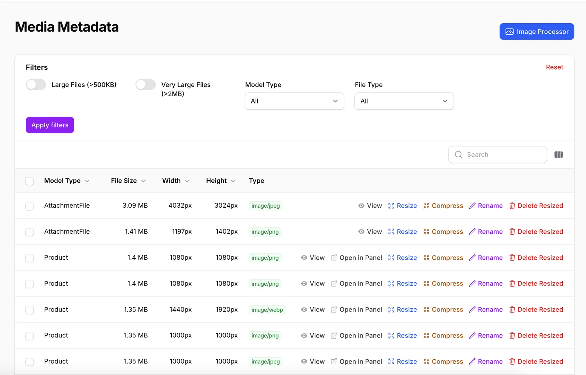
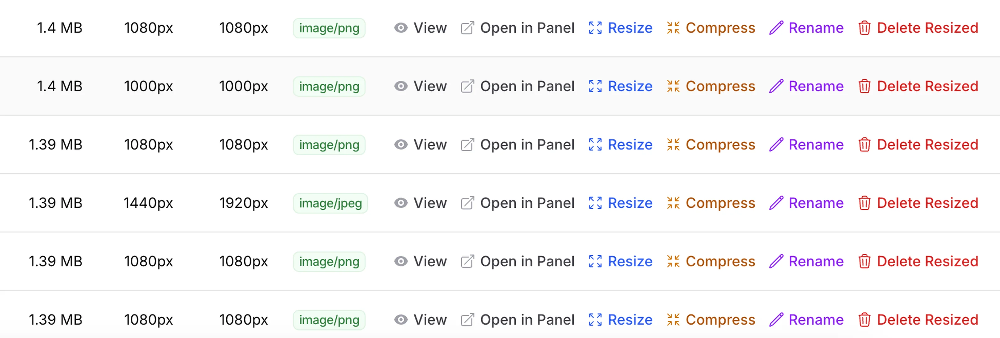
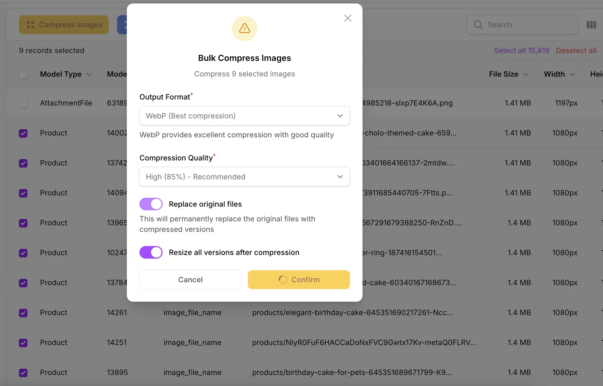
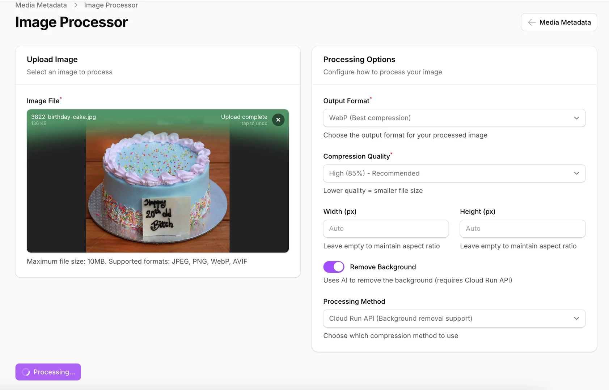
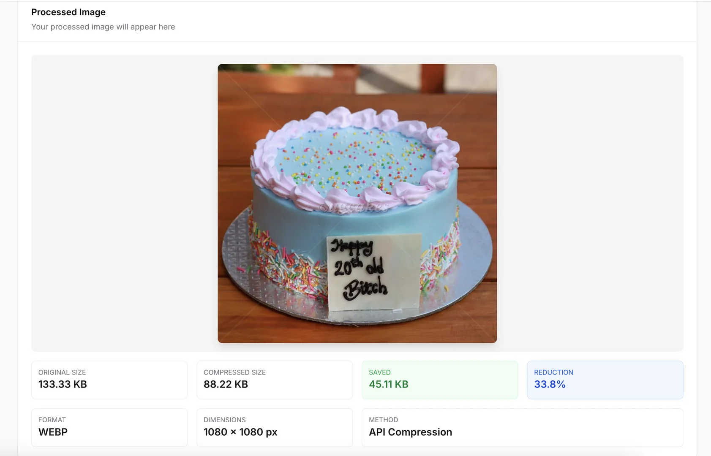

[](https://packagist.org/packages/kirantimsina/file-manager)
[](https://packagist.org/packages/kirantimsina/file-manager)

# Laravel File Manager for Filament

A comprehensive Laravel package for **Filament v4** that provides advanced file management with automatic image resizing, compression, media metadata tracking, and seamless S3 integration. Built for high-performance applications handling large volumes of media content.

This package is developed and maintained by **Kiran Timsina** and **RayzenTech**.

## Key Features

### Core Features

-   🖼️ **Automatic Image Resizing** - Generate multiple sizes automatically on upload
-   🗜️ **Smart Compression** - WebP/AVIF conversion with configurable quality settings
-   🎬 **Video Compression** - FFmpeg-based video optimization with WebM/MP4 output, H.264/H.265/VP9 codecs
-   🎭 **AI Background Removal** - Remove backgrounds from images using Cloud Run API
-   📊 **Media Metadata Tracking** - Track file sizes, dimensions, and compression stats
-   ☁️ **S3 Integration** - Seamless AWS S3 storage with CDN support
-   ⚡ **Cache Control Headers** - Configurable browser/CDN caching for optimal performance
-   📏 **Smart File Size Limits** - Automatic detection and different limits for images (8MB), videos (100MB), and documents (20MB)
-   🛠️ **Artisan Commands** - CLI tools for populating metadata with progress tracking
-   📁 **Media Metadata Resource** - Dedicated admin page for managing media with bulk operations
-   🖼️ **Image Processor Page** - Interactive tool for testing compression and processing settings

### Advanced Processing

-   ⚡ **Dual API System** - Fast Lambda API for compression, Cloud Run for AI features
-   🎨 **Flexible Driver System** - Choose between GD library or external APIs
-   🖼️ **Interactive Processor** - Test and process images directly in admin panel
-   📈 **Bulk Operations** - Process multiple files with detailed progress tracking
-   🔄 **Smart Fallbacks** - Automatic fallback to GD when API unavailable

### Developer Experience

-   🎨 **Custom Filament Components** - MediaUpload and S3Image components
-   🔍 **Advanced Resource Management** - Built-in media metadata interface with bulk actions
-   🚀 **Performance Optimized** - Queue-based processing with chunked operations
-   🔧 **Highly Configurable** - Extensive configuration with environment variables
-   📝 **Comprehensive CLI** - Powerful artisan commands with progress tracking

## About the Developers

**Kiran Timsina** is a full-stack developer specializing in Laravel and Filament applications. Connect on [GitHub](https://github.com/kirantimsina).

**RayzenTech** is a tech startup based in Nepal focused on creating smart business solutions. We specialize in automating complex processes and making them simple, from business automation to robotic process automation. Learn more at [RayzenTech](https://www.rayzentech.com).

---

## Requirements

-   PHP 8.1+
-   Laravel 10.0+
-   Filament 4.0+
-   AWS S3 configured (or S3-compatible storage)
-   FFmpeg (optional, required for video compression)

## Storage Configuration

This package works with both AWS S3 and Cloudflare R2. Choose one of the following configurations:

### Option 1: Using AWS S3

#### 1. Configure `.env` file:

```env
# AWS S3 Configuration
FILESYSTEM_DISK=s3

AWS_ACCESS_KEY_ID=your-access-key-id
AWS_SECRET_ACCESS_KEY=your-secret-access-key
AWS_DEFAULT_REGION=us-east-1  # Your preferred region
AWS_BUCKET=your-bucket-name
AWS_URL=https://your-bucket.s3.amazonaws.com
# Or if using CloudFront:
# AWS_URL=https://your-cloudfront-distribution.cloudfront.net

# Optional CDN URL (defaults to AWS_URL)
CDN_URL=https://your-cdn-url.com
```

#### 2. Configure `config/filesystems.php`:

```php
'default' => env('FILESYSTEM_DISK', 's3'),

'disks' => [
    's3' => [
        'driver' => 's3',
        'key' => env('AWS_ACCESS_KEY_ID'),
        'secret' => env('AWS_SECRET_ACCESS_KEY'),
        'region' => env('AWS_DEFAULT_REGION'),
        'bucket' => env('AWS_BUCKET'),
        'url' => env('AWS_URL'),
        'endpoint' => env('AWS_ENDPOINT'),
        'use_path_style_endpoint' => env('AWS_USE_PATH_STYLE_ENDPOINT', false),
        'throw' => false,
    ],
],
```

#### 3. Configure `config/livewire.php` (if using Livewire uploads):

```php
'temporary_file_upload' => [
    'disk' => 's3',  // Use S3 for temporary uploads
    'rules' => ['required', 'file', 'max:122880'],
    'directory' => 'livewire-tmp',
    'middleware' => null,
    'preview_mimes' => [
        'png', 'gif', 'bmp', 'svg', 'wav', 'mp4',
        'mov', 'avi', 'wmv', 'mp3', 'm4a',
        'jpg', 'jpeg', 'mpga', 'webp', 'wma',
    ],
    'max_upload_time' => 5,
    'cleanup' => true,
],
```

### Option 2: Using Cloudflare R2

#### 1. Configure `.env` file:

```env
# Cloudflare R2 Configuration
FILESYSTEM_DISK=r2

CLOUDFLARE_R2_ACCESS_KEY_ID=your-r2-access-key
CLOUDFLARE_R2_SECRET_ACCESS_KEY=your-r2-secret-key
CLOUDFLARE_R2_BUCKET=your-bucket-name
CLOUDFLARE_R2_ENDPOINT=https://your-account-id.r2.cloudflarestorage.com
CLOUDFLARE_R2_URL=https://your-custom-domain.com
# Or use R2 public URL:
# CLOUDFLARE_R2_URL=https://pub-xxxxx.r2.dev
CLOUDFLARE_R2_USE_PATH_STYLE_ENDPOINT=false

# Optional CDN URL (defaults to CLOUDFLARE_R2_URL)
CDN_URL=https://your-custom-domain.com
```

#### 2. Configure `config/filesystems.php`:

```php
'default' => env('FILESYSTEM_DISK', 'r2'),

'disks' => [
    's3' => [
        'driver' => 's3',
        'key' => env('AWS_ACCESS_KEY_ID'),
        'secret' => env('AWS_SECRET_ACCESS_KEY'),
        'region' => env('AWS_DEFAULT_REGION'),
        'bucket' => env('AWS_BUCKET'),
        'url' => env('AWS_URL'),
        'endpoint' => env('AWS_ENDPOINT'),
        'use_path_style_endpoint' => env('AWS_USE_PATH_STYLE_ENDPOINT', false),
        'throw' => false,
    ],

    'r2' => [
        'driver' => 's3',
        'key' => env('CLOUDFLARE_R2_ACCESS_KEY_ID'),
        'secret' => env('CLOUDFLARE_R2_SECRET_ACCESS_KEY'),
        'region' => 'auto',  // Always use 'auto' for R2
        'bucket' => env('CLOUDFLARE_R2_BUCKET'),
        'url' => env('CLOUDFLARE_R2_URL'),
        'visibility' => 'private',
        'endpoint' => env('CLOUDFLARE_R2_ENDPOINT'),
        'use_path_style_endpoint' => env('CLOUDFLARE_R2_USE_PATH_STYLE_ENDPOINT', false),
        'throw' => false,
    ],
],
```

#### 3. Configure `config/livewire.php` (if using Livewire uploads):

```php
'temporary_file_upload' => [
    'disk' => 'r2',  // Use R2 for temporary uploads
    'rules' => ['required', 'file', 'max:122880'],
    'directory' => 'livewire-tmp',
    'middleware' => null,
    'preview_mimes' => [
        'png', 'gif', 'bmp', 'svg', 'wav', 'mp4',
        'mov', 'avi', 'wmv', 'mp3', 'm4a',
        'jpg', 'jpeg', 'mpga', 'webp', 'wma',
    ],
    'max_upload_time' => 5,
    'cleanup' => true,
],
```

### Option 3: Using S3 Disk with R2 (Simplified)

If you prefer to use the standard S3 configuration with R2, you can configure R2 using the AWS environment variables:

#### Configure `.env` file:

```env
# Use S3 disk with R2 credentials
FILESYSTEM_DISK=s3

AWS_ACCESS_KEY_ID=your-r2-access-key
AWS_SECRET_ACCESS_KEY=your-r2-secret-key
AWS_DEFAULT_REGION=auto  # Always 'auto' for R2
AWS_BUCKET=your-bucket-name
AWS_ENDPOINT=https://your-account-id.r2.cloudflarestorage.com
AWS_URL=https://your-custom-domain.com
AWS_USE_PATH_STYLE_ENDPOINT=false

CDN_URL=https://your-custom-domain.com
```

This approach uses the existing `s3` disk configuration in `filesystems.php` without creating a separate `r2` disk.

### Storage Driver Comparison

| Feature | AWS S3 | Cloudflare R2 |
|---------|--------|---------------|
| **Storage Cost** | ~$0.023/GB | $0.015/GB |
| **Egress Fees** | $0.09/GB after 1GB | $0 (free egress) |
| **API Compatibility** | Native S3 API | S3-compatible API |
| **Region Config** | Specific region (e.g., us-east-1) | Always use 'auto' |
| **Best For** | AWS ecosystem integration | Cost-effective, high bandwidth usage |

## Installation

1. **Install via Composer:**

    ```bash
    composer require rayzenai/file-manager
    ```

2. **Publish the configuration:**

    ```bash
    php artisan vendor:publish --tag="file-manager-config"
    ```

3. **Publish and run migrations (for media metadata):**

    ```bash
    # Publish migration files to your app
    php artisan vendor:publish --provider="Kirantimsina\FileManager\FileManagerServiceProvider" --tag="file-manager-migrations"

    # Run the migrations
    php artisan migrate
    ```

4. **Configure storage and environment variables:**

    See the [Storage Configuration](#storage-configuration) section above for detailed setup instructions for AWS S3 or Cloudflare R2.

    **Additional configuration options for `.env`:**

    ```env
    # Cache Control Settings (Optional)
    FILE_MANAGER_CACHE_ENABLED=true
    FILE_MANAGER_CACHE_MAX_AGE=31536000  # 1 year in seconds
    FILE_MANAGER_CACHE_VISIBILITY=public  # 'public' or 'private'
    FILE_MANAGER_CACHE_IMMUTABLE=true     # Add immutable directive

    # Compression Settings (Optional)
    FILE_MANAGER_COMPRESSION_ENABLED=true
    FILE_MANAGER_COMPRESSION_QUALITY=85 # 1-100, quality level
    FILE_MANAGER_COMPRESSION_FORMAT=webp # webp, jpg, png, avif

    # Maximum image dimensions (images larger than this will be scaled down)
    FILE_MANAGER_MAX_HEIGHT=2160  # Maximum height in pixels
    FILE_MANAGER_MAX_WIDTH=3840   # Maximum width in pixels

    # Compression Method Settings
    FILE_MANAGER_COMPRESSION_METHOD=gd  # 'gd' for built-in PHP processing or 'api' for external service

    # Primary API Settings (Fast compression, no background removal)
    FILE_MANAGER_COMPRESSION_API_URL=https://your-aws-lambda-url.com/process-image
    FILE_MANAGER_COMPRESSION_API_TOKEN=your-api-token
    FILE_MANAGER_COMPRESSION_API_TIMEOUT=30

    # Background Removal API Settings (Slower, supports background removal)
    FILE_MANAGER_BG_REMOVAL_API_URL=https://your-gcp-run-url.com/process-image
    FILE_MANAGER_BG_REMOVAL_API_TOKEN=your-bg-removal-token
    FILE_MANAGER_BG_REMOVAL_API_TIMEOUT=60
    ```

5. **Register the plugin in your Filament panel provider:**

    ```php
    use Kirantimsina\FileManager\FileManagerPlugin;

    public function panel(Panel $panel): Panel
    {
        return $panel
            ->plugins([
                FileManagerPlugin::make(),
            ]);
    }
    ```

## Configuration

The configuration file `config/file-manager.php` allows you to customize:

```php
return [
    // CDN URL for serving files
    'cdn' => env('CDN_URL', env('AWS_URL', env('APP_URL'))),

    // Maximum upload dimensions
    'max-upload-height' => '5120', // pixels
    'max-upload-width' => '5120',  // pixels

    // File upload size limits by type
    'max-upload-size-image' => '8192',     // KB - Max size for image uploads (8 MB)
    'max-upload-size-video' => '102400',   // KB - Max size for video uploads (100 MB)
    'max-upload-size-document' => '20480', // KB - Max size for document uploads (20 MB)

    // Model to directory mappings (supports full class names)
    'model' => [
        'App\Models\User' => 'users',       // Or use User::class
        'App\Models\Product' => 'products', // Or use Product::class
        'App\Models\Blog' => 'blogs',       // Or use Blog::class
        // Add your models here
    ],

    // Image sizes to generate
    // Set to empty array [] to disable automatic resizing completely
    'image_sizes' => [
        'icon' => 64,       // 64px height for small icons
        'small' => 120,     // 120px height for small thumbnails
        'thumb' => 240,     // 240px height for thumbnails
        'card' => 360,      // 360px height for card images
        'medium' => 480,    // 480px height for medium images
        'large' => 720,     // 720px height for large images
        'full' => 1080,     // 1080px height for full size
        'ultra' => 2160,    // 2160px height for ultra HD
    ],

    // Default thumbnail size for MediaColumn components
    'default_thumbnail_size' => env('FILE_MANAGER_DEFAULT_THUMBNAIL_SIZE', 'icon'),
    'default_card_size' => env('FILE_MANAGER_DEFAULT_CARD_SIZE', 'card'),

    // Cache Control Headers for Media Files
    'cache' => [
        'enabled' => env('FILE_MANAGER_CACHE_ENABLED', true),

        // Cache duration in seconds
        // Common values:
        // 3600 = 1 hour
        // 86400 = 1 day
        // 604800 = 1 week
        // 2592000 = 30 days
        // 31536000 = 1 year (default)
        'max_age' => env('FILE_MANAGER_CACHE_MAX_AGE', 31536000),

        // Cache visibility:
        // 'public' - Can be cached by browsers and CDNs
        // 'private' - Only cached by browsers, not CDNs
        'visibility' => env('FILE_MANAGER_CACHE_VISIBILITY', 'public'),

        // Immutable directive - tells browsers the file will never change
        // Recommended for versioned/hashed filenames
        'immutable' => env('FILE_MANAGER_CACHE_IMMUTABLE', true),
    ],

    // Compression settings
    'compression' => [
        'enabled' => env('FILE_MANAGER_COMPRESSION_ENABLED', true),
        'method' => env('FILE_MANAGER_COMPRESSION_METHOD', 'gd'), // 'gd' or 'api'
        'auto_compress' => env('FILE_MANAGER_AUTO_COMPRESS', true),
        'quality' => env('FILE_MANAGER_COMPRESSION_QUALITY', 85), // 1-95
        'format' => env('FILE_MANAGER_COMPRESSION_FORMAT', 'webp'), // webp, jpeg, jpg, png, avif
        'mode' => env('FILE_MANAGER_COMPRESSION_MODE', 'contain'), // contain, crop, cover
        'threshold' => env('FILE_MANAGER_COMPRESSION_THRESHOLD', 100 * 1024), // 100KB

        // Maximum allowed dimensions (hard limits - images will never exceed these)
        'max_height' => env('FILE_MANAGER_MAX_HEIGHT', 2160),
        'max_width' => env('FILE_MANAGER_MAX_WIDTH', 3840),

        // API settings for external compression
        'api' => [
            // Primary API (AWS Lambda - fast, no background removal)
            'url' => env('FILE_MANAGER_COMPRESSION_API_URL', ''),
            'token' => env('FILE_MANAGER_COMPRESSION_API_TOKEN', ''),
            'timeout' => env('FILE_MANAGER_COMPRESSION_API_TIMEOUT', 30),

            // Background removal API (Google Cloud Run - slower, supports bg removal)
            'bg_removal' => [
                'url' => env('FILE_MANAGER_BG_REMOVAL_API_URL', ''),
                'token' => env('FILE_MANAGER_BG_REMOVAL_API_TOKEN', ''),
                'timeout' => env('FILE_MANAGER_BG_REMOVAL_API_TIMEOUT', 60),
            ],
        ],
    ],

    // Media metadata tracking
    'media_metadata' => [
        'enabled' => env('FILE_MANAGER_METADATA_ENABLED', true),
        'track_file_size' => env('FILE_MANAGER_TRACK_FILE_SIZE', true),
        'track_dimensions' => env('FILE_MANAGER_TRACK_DIMENSIONS', true),
        'track_mime_type' => env('FILE_MANAGER_TRACK_MIME_TYPE', true),
        'model' => \Kirantimsina\FileManager\Models\MediaMetadata::class,
    ],
];
```

## Usage in Models

### Using the HasMultimedia Trait

The `HasMultimedia` trait automatically handles media file processing including image resizing, video compression, and document management:

```php
use Kirantimsina\FileManager\Traits\HasMultimedia;
use Illuminate\Database\Eloquent\Model;

class Product extends Model
{
    use HasMultimedia;

    protected $fillable = [
        'name',
        'image',        // Single image field
        'gallery',      // Multiple images field
        'demo_video',   // Video field
        'manual_pdf',   // Document field
    ];

    protected $casts = [
        'gallery' => 'array', // Cast array fields
    ];

    /**
     * Define which fields contain media files and their types
     * Required by HasMultimedia trait for automatic processing
     */
    public function mediaFieldsToWatch(): array
    {
        return [
            'images' => ['image', 'gallery'],
            'videos' => ['demo_video', 'promo_video'],
            'documents' => ['manual_pdf', 'specifications'],
        ];
    }

    /**
     * Optional: Define which field should be used for SEO title generation
     * Remove this method if SEO titles are not needed for this model
     */
    public function seoTitleField(): string
    {
        return 'name'; // or 'meta_title', 'seo_title', etc.
    }
}
```

**Key Features:**

-   Automatically generates multiple sizes when images are saved
-   Handles both single images and arrays of images
-   Smart diffing - only resizes truly new images
-   Automatic cleanup of old media files when replaced
-   Queue-based processing for better performance
-   Video compression with configurable codecs and quality
-   Document file support without unwanted processing
-   Automatic file type detection based on field configuration

## Usage in Filament Resources

### SEO Title Support

The package includes built-in SEO title functionality for better search engine optimization of media files:

```php
use Kirantimsina\FileManager\Forms\Components\MediaUpload;

// Set SEO title directly
MediaUpload::make('image')
    ->seoTitle('Premium Chocolate Cake')

// Set SEO title from another field
MediaUpload::make('image')
    ->seoTitleFromField('name')  // Uses the 'name' field value as SEO title

// Dynamic SEO title with closure
MediaUpload::make('image')
    ->seoTitle(fn (Get $get) => $get('meta_title') ?? $get('name'))
```

**Configuration:**

Control which models receive SEO titles in `config/file-manager.php`:

```php
'seo' => [
    'enabled_models' => [
        'App\Models\Product',
        'App\Models\Category',
        'App\Models\Blog',
        // Models that should have SEO titles
    ],
    'excluded_models' => [
        'App\Models\User',
        'App\Models\Order',
        // Models that should NOT have SEO titles
    ],
],
```

### MediaUpload Component

The `MediaUpload` component extends Filament's `FileUpload` with automatic compression and metadata tracking:

```php
use Kirantimsina\FileManager\Forms\Components\MediaUpload;

// Example 1: Convert to WebP with custom quality
MediaUpload::make('image')
    ->label('Product Image')
    ->quality(90)               // Compression quality, capped at 95
    ->toWebp()                  // Convert to WebP format

// Example 2: Compress but keep original format (JPEG stays JPEG, PNG stays PNG)
MediaUpload::make('photo')
    ->keepOriginalFormat()      // Compress but maintain original format
    ->quality(85)               // Still applies compression

// Example 3: Upload without ANY processing
MediaUpload::make('document')
    ->uploadOriginal()          // Skip all processing - no compression, no conversion

// Example 4: Full featured upload with background removal
MediaUpload::make('product_image')
    ->toAvif()                  // Convert to AVIF format
    ->quality(90)               // High quality
    ->removeBg()                // Remove background (API required)
    ->driver('api')             // Use API compression
    ->trackMetadata()           // Track file metadata
    ->multiple()                // Allow multiple files
```

**Available Methods:**

**Image Methods:**
-   `quality(int $quality)`: Set compression quality (1-95, default: from config)
-   `format(string $format)`: Set output format ('webp', 'jpeg', 'jpg', 'png', 'avif', 'original')
-   `toWebp()`: Convert images to WebP format
-   `toAvif()`: Convert images to AVIF format (might not be available with GD)
-   `keepOriginalFormat()`: Compress but keep the original file format
-   `uploadOriginal()`: Skip ALL processing - no compression, no resizing, no format conversion
-   `trackMetadata()`: Enable/disable metadata tracking
-   `removeBg()`: Enable background removal (API only)
-   `driver('gd'|'api')`: Choose compression driver
-   `resize()`: Enable Filament's built-in resizing (opposite of uploadOriginal)

**Video Methods:**
-   `toWebm()`: Complete WebM setup with optimal settings (1000kbps, 1080p, CRF 30)
-   `toMp4()`: Complete MP4 setup with optimal settings (1500kbps, 1080p, CRF 23)
-   `compressVideo()`: Enable video compression
-   `videoFormat('webm'|'mp4')`: Set video output format
-   `videoBitrate(int)`: Set video bitrate in kbps
-   `videoMaxDimensions(width, height)`: Set maximum video dimensions
-   `videoPreset('ultrafast'|'fast'|'medium'|'slow'|'veryslow')`: Encoding speed/quality trade-off
-   `videoCrf(int)`: Set quality (0-63, lower = better)
-   `videoAsync(bool)`: Enable async processing (recommended)

**Important Notes:**

-   **Compression:** Images are automatically compressed when enabled in config (unless `uploadOriginal()` is called)
-   **Format Control:** Use `toWebp()`, `toAvif()`, or `format()` to override config format
-   **Upload Original:** Call `uploadOriginal()` to skip ALL processing and upload file exactly as-is

**Features:**

-   Smart compression with configurable output format (WebP/JPEG/PNG/AVIF)
-   AI-powered background removal (API only)
-   Metadata tracking with compression stats
-   Supports both images and videos
-   SEO-friendly file naming

#### Background Removal

The `removeBg()` method enables AI-powered background removal for images. This feature **requires external API configuration** (specifically the background removal API endpoint) and is not available with the GD library method.

#### Compression Drivers

You can specify which compression driver to use:

```php
// Use GD library (built-in PHP processing)
MediaUpload::make('image')
    ->driver('gd')

// Use external API service
MediaUpload::make('image')
    ->driver('api')
```

The package supports two external APIs:

-   **Primary API** (AWS Lambda): Fast compression without background removal
-   **Background Removal API** (Google Cloud Run): Slower but supports AI background removal

```php
// Enable background removal with boolean
MediaUpload::make('image')
    ->removeBg(true)

// Or use the convenience method
MediaUpload::make('image')
    ->withoutBackground()

// Dynamic background removal with closure
use Filament\Forms\Components\Toggle;

Toggle::make('remove_bg')
    ->label('Remove Background')
    ->dehydrated(false)  // Don't save to database

MediaUpload::make('image')
    ->removeBg(fn (Get $get) => $get('remove_bg'))
```

**Important:** When using Toggle fields for background removal control, use `dehydrated(false)` or handle the field in `mutateFormDataBeforeCreate()` and `mutateFormDataBeforeSave()` to prevent database errors:

```php
// In your Filament Resource
protected function mutateFormDataBeforeCreate(array $data): array
{
    unset($data['remove_bg']);
    return $data;
}

protected function mutateFormDataBeforeSave(array $data): array
{
    unset($data['remove_bg']);
    return $data;
}
```

### MediaModalColumn and MediaUrlColumn

Display images in tables with different interaction styles:

#### MediaModalColumn

Display images with modal preview and optional editing capabilities:

```php
use Kirantimsina\FileManager\Tables\Columns\MediaModalColumn;

// Basic usage with modal preview
MediaModalColumn::make('image_file_name')
    ->label('Product Image')
    ->thumbnailSize('small')
    ->modalSize('large')
    ->allowEdit() // Enable editing in modal

// With custom heading and relationship
MediaModalColumn::make('attachment_file_name')
    ->label('Attachments')
    ->relationship('attachments')
    ->heading('View Attachments')
    ->multiple() // Handle multiple images
    ->downloadable() // Allow downloads
    ->previewable() // Enable preview

// Legacy dot notation (still supported)
MediaModalColumn::make('product.image_file_name')
    ->label('Product Image')
    ->thumbnailSize('medium')
```

#### MediaUrlColumn

Display images that link to a dedicated media page:

```php
use Kirantimsina\FileManager\Tables\Columns\MediaUrlColumn;

// Basic usage - links to media page
MediaUrlColumn::make('image_file_name')
    ->label('Product Image')
    ->thumbnailSize('small')
    ->openInNewTab() // Open link in new tab

// With relationship
MediaUrlColumn::make('featured_image')
    ->label('Featured Image')
    ->relationship('media')
    ->thumbnailSize('card')
```

**Common Methods (both components):**

-   `thumbnailSize()`: Set thumbnail size ('icon', 'small', 'medium', 'large', etc.)
-   `label()`: Column label
-   `relationship()`: Name of the Eloquent relationship (for HasMany, HasOne, BelongsTo)
-   `showMetadata()`: Show file metadata in tooltip
-   `viewCountField()`: Field to track view counts

**MediaModalColumn specific methods:**

-   `modalSize()`: Size for modal preview images
-   `heading()`: Modal heading (closure or string)
-   `allowEdit()`: Enable editing images in modal
-   `multiple()`: Handle multiple images
-   `downloadable()`: Allow image downloads
-   `previewable()`: Enable image preview
-   `uploadOriginal()`: Upload file as-is without any processing (default: false)

**MediaUrlColumn specific methods:**

-   `openInNewTab()`: Open media page in new tab (default: true)

**Features:**

-   **Direct field access**: Works with model attributes directly
-   **Relationship support**: Access images through Eloquent relationships
-   **Dot notation**: Legacy support for nested relationships
-   **Modal editing**: View and replace images through modal interface
-   **Multiple images**: Handles both single and multiple image fields
-   **Smart loading**: Automatically loads relationships to prevent N+1 queries
-   **Metadata display**: Optional file size and type information

**Relationship Support (v4.3+):**

The `relationship` parameter allows you to display and manage images from related models:

```php
// In your model
class CartItem extends Model
{
    public function attachments(): HasMany
    {
        return $this->hasMany(AttachmentFile::class);
    }
}

// In your Filament resource
MediaColumn::make(
    field: 'attachment_file_name',  // Field on the AttachmentFile model
    relationship: 'attachments',     // Relationship method name
    showInModal: true
)
```

This will:

-   Display all attachment images in the table column
-   Allow viewing all images in a modal
-   Enable uploading new images that will replace existing attachments
-   Handle HasMany, HasOne, and BelongsTo relationships automatically

#### Default Sizes

You can configure default sizes for MediaColumn components in your configuration:

```php
// config/file-manager.php
'default_thumbnail_size' => 'thumb', // Default for thumbnail displays
'default_card_size' => 'large',     // Default for card displays
```

Or via environment variables:

```env
FILE_MANAGER_DEFAULT_THUMBNAIL_SIZE=thumb
FILE_MANAGER_DEFAULT_CARD_SIZE=large
```

**Available size configurations:**

-   **`default_thumbnail_size`**: Used for thumbnail displays in table columns (default: `'icon'`)
-   **`default_card_size`**: Used for larger preview displays like modals (default: `'card'`)

Individual columns can still override these defaults (limited to thumbnail size only):

```php
MediaModalColumn::make('image')
    ->thumbnailSize('large') // This overrides the default

MediaUrlColumn::make('image')
    ->thumbnailSize('large') // This overrides the default
```

### S3Image Column

Display images in tables with modal preview:

```php
use Kirantimsina\FileManager\Tables\Columns\S3Image;

S3Image::make('image')
    ->label('Image')
    ->size('medium')     // Use specific size: 'small', 'medium', 'large'
    ->square()           // Square aspect ratio
    ->circular()         // Circular mask
```

## Media Metadata Management

The package includes a powerful Filament resource for comprehensive media management.



### Dashboard Features

#### Navigation & Monitoring

-   **Smart Navigation Badge**: Real-time count of large files (>500KB)
    -   🔵 Info: 1-50 large files
    -   🟡 Warning: 51-100 large files
    -   🔴 Danger: 100+ large files
-   **Automatic cache refresh** every 5 minutes

#### File Management

-   **Comprehensive file listing** with:
    -   Model type and ID
    -   Field name
    -   File size with human-readable format
    -   Image dimensions (width × height)
    -   MIME type with color-coded badges
    -   Creation and update timestamps

#### Advanced Filtering

-   **Quick Filters**:
    -   Inefficient Images (>0.35 bytes per pixel, >10KB) - Smart filter for images that would benefit from WebP compression
    -   Large Files (>500KB)
    -   Very Large Files (>2MB)
-   **Model Type Filter**: Filter by specific models
-   **File Type Filter**: Filter by MIME type
-   **Search**: Find files by name or path


### Individual File Actions



1. **Open in Panel**: Navigate directly to the parent resource
2. **Resize**: Generate all configured size variations
3. **Compress**: Apply custom compression settings
4. **Rename**: Update file names in database
5. **Delete Resized**: Remove all size variations

### Bulk Operations



#### Bulk Compress

-   Select multiple images for compression
-   Choose output format (WebP, AVIF, JPEG, PNG)
-   Set compression quality (50-100%)
-   Option to replace originals
-   Detailed progress reporting

#### Bulk Resize

-   Generate all size variations for selected images
-   Queue-based processing for performance
-   Progress notifications

#### Bulk Delete Resized

-   Remove all resized versions for selected images
-   Confirmation dialog with warnings
-   Batch processing with result summary

### Image Processor Page

The MediaMetadata resource includes a dedicated **Image Processor** page - a powerful tool for testing and optimizing your image processing pipeline.



#### Features:

**Upload & Process**

-   Drag-and-drop or click to upload images up to 10MB
-   Support for JPEG, PNG, WebP, and AVIF formats
-   Real-time preview of uploaded images

**Processing Options**

-   **Format Selection**: Convert between WebP, JPEG, PNG, and AVIF
-   **Quality Control**: Adjust compression from 50% to 100%
-   **Resizing**: Set custom dimensions with multiple resize modes
-   **Background Removal**: AI-powered background removal (when API configured)

**Compression Methods**

-   **Auto**: Intelligently selects the best available method
-   **Lambda API**: Fast compression via AWS Lambda
-   **Cloud Run API**: Advanced features including background removal
-   **GD Library**: Local processing fallback

**Results & Analytics**

-   Side-by-side comparison of original vs processed
-   Detailed statistics:
    -   Original and compressed file sizes
    -   Space saved (KB and percentage)
    -   Final dimensions
    -   Processing method used
-   Download processed images directly



#### Use Cases:

1. **Test compression settings** before applying to production
2. **Optimize images** for specific use cases
3. **Validate API configuration** and performance
4. **Compare processing methods** (GD vs API)
5. **Generate samples** for documentation

## Service Methods

### Using the FileManager Facade

```php
use App\Models\Product;
use Kirantimsina\FileManager\Facades\FileManager;

// Upload a file
$result = FileManager::upload(
    Product::class,      // model class
    $uploadedFile,       // file
    'summer-sale',       // tag (optional)
    false,               // fit (optional, default: false)
    true,                // resize (optional, default: true)
    false,               // webp (optional, default: false)
    false                // reencode (optional, default: false)
);
$path = $result['file']; // Get the file path from result

// Upload multiple files
$result = FileManager::uploadImages(
    Product::class,      // model class
    $uploadedFiles,      // files array
    'gallery',           // tag (optional)
    false,               // fit (optional)
    true                 // resize (optional)
);
$paths = $result['files']; // Get array of file paths

// Upload base64 encoded image
$result = FileManager::uploadBase64(
    Product::class,      // model class
    $base64String,       // base64 image
    'user-upload',       // tag (optional)
    false,               // fit (optional)
    true                 // resize (optional)
);
$path = $result['file']; // Get the file path from result

// Move temp file without resizing
$path = FileManager::moveTempImageWithoutResize(
    Product::class,      // model class
    'temp/abc123.jpg'    // temp file path
);

// Move temp file with automatic resizing
$path = FileManager::moveTempImage(
    Product::class,      // model class
    'temp/abc123.jpg'    // temp file path
);

// Delete image and all its sizes
FileManager::deleteImage('products/image.jpg');

// Delete multiple images
FileManager::deleteImagesArray(['products/img1.jpg', 'products/img2.jpg']);

// Get SEO-friendly filename
$filename = FileManager::filename(
    file: $uploadedFile,
    tag: 'product-name',
    extension: 'webp'
);

// Get image URL with specific size
$url = FileManager::getMediaPath('products/image.jpg', 'medium');

// Get CDN URL
$cdnUrl = FileManager::mainMediaUrl();

// Get upload directory for a model
$directory = FileManager::getUploadDirectory(Product::class);

// Get configured image sizes
$sizes = FileManager::getImageSizes();
```

### Image Compression Service

```php
use Kirantimsina\FileManager\Services\ImageCompressionService;

$service = new ImageCompressionService();

// Compress and save
$result = $service->compressAndSave(
    sourcePath: '/tmp/upload.jpg',
    destinationPath: 'products/compressed.webp',
    quality: 85,
    height: 1080,
    width: null,  // Auto-calculate
    format: 'webp',
    mode: 'contain',
    disk: 's3',
    removeBg: false  // Set to true for background removal (API only)
);

// Compress with background removal (requires API configuration)
$result = $service->compressAndSave(
    sourcePath: '/tmp/product.jpg',
    destinationPath: 'products/product-no-bg.webp',
    quality: 90,
    height: 720,
    width: null,
    format: 'webp',
    mode: 'contain',
    disk: 's3',
    removeBg: true  // Requires FILE_MANAGER_COMPRESSION_METHOD=api
);

// Compress existing S3 file
$result = $service->compressExisting(
    filePath: 'products/large-image.jpg',
    quality: 80
);
```

**Compression Methods:**

-   **GD Library (`method: 'gd'`)**: Built-in PHP image processing. Supports resizing, format conversion, and basic compression. Does not support background removal.
-   **External API (`method: 'api'`)**: Uses external image processing service. Supports all GD features plus AI-powered background removal. The package intelligently routes requests:
    -   Standard compression requests go to the primary API (faster)
    -   Background removal requests go to the specialized background removal API (slower but more features)
    -   Falls back to GD if API is unavailable

### Video Compression Service

The package now includes comprehensive video compression capabilities using FFmpeg to convert and optimize video files.

**Prerequisites:**
```bash
# Install FFmpeg on your system
# macOS:
brew install ffmpeg

# Ubuntu/Debian:
sudo apt-get update
sudo apt-get install ffmpeg

# CentOS/RHEL:
sudo yum install ffmpeg

# Windows:
# Download from https://ffmpeg.org/download.html
```

**Configuration:**
```env
# Video Compression Settings
FILE_MANAGER_VIDEO_COMPRESSION_ENABLED=true
FILE_MANAGER_VIDEO_COMPRESSION_METHOD=ffmpeg
FILE_MANAGER_VIDEO_COMPRESSION_FORMAT=webm     # webm or mp4
FILE_MANAGER_VIDEO_CODEC=libvpx-vp9            # libvpx-vp9, libvpx, libx264, libx265
FILE_MANAGER_AUDIO_CODEC=libopus               # libopus, libvorbis, aac
FILE_MANAGER_VIDEO_BITRATE=1000                # kbps
FILE_MANAGER_AUDIO_BITRATE=128                 # kbps
FILE_MANAGER_VIDEO_MAX_WIDTH=1920
FILE_MANAGER_VIDEO_MAX_HEIGHT=1080
FILE_MANAGER_VIDEO_FRAME_RATE=30
FILE_MANAGER_VIDEO_PRESET=medium               # ultrafast, fast, medium, slow, veryslow
FILE_MANAGER_VIDEO_CRF=30                      # 0-63, lower = better quality
FILE_MANAGER_VIDEO_THREADS=4
FILE_MANAGER_VIDEO_TIMEOUT=3600                # seconds
FILE_MANAGER_VIDEO_THUMBNAIL=true
FILE_MANAGER_VIDEO_THUMBNAIL_TIME=1.0          # seconds into video
```

**Using Video Compression in Forms:**
```php
use Kirantimsina\FileManager\Forms\Components\MediaUpload;

// Quick setup with optimal settings (recommended)
MediaUpload::make('promo_video')
    ->toWebm()  // Complete WebM configuration with optimal settings

MediaUpload::make('demo_video')
    ->toMp4()   // Complete MP4 configuration with optimal settings

// Manual configuration for custom requirements
MediaUpload::make('video')
    ->acceptedFileTypes(['video/mp4', 'video/webm', 'video/quicktime'])
    ->compressVideo()                  // Enable video compression
    ->videoFormat('webm')              // Output format: webm or mp4
    ->videoBitrate(800)                // Video bitrate in kbps
    ->videoMaxDimensions(1280, 720)   // Max width and height
    ->videoPreset('fast')              // Encoding preset
    ->videoCrf(28)                     // Quality (0-63, lower = better)
    ->videoAsync(true)                 // Process asynchronously (recommended)
```

**Convenience Helper Methods:**

The package provides two convenient helper methods that configure all video settings with a single call:

**`toWebm()`** - Optimized for web delivery with WebM format:
- Accepts common video formats (MP4, WebM, QuickTime, M4V)
- Outputs WebM format with VP9 codec
- 1000 kbps bitrate for balanced quality/size
- 1920x1080 max dimensions (Full HD)
- Medium preset for optimal encoding speed
- CRF 30 for good compression
- Async processing enabled

**`toMp4()`** - Universal compatibility with MP4 format:
- Accepts common video formats (MP4, WebM, QuickTime, M4V)
- Outputs MP4 format with H.264 codec
- 1500 kbps bitrate for better quality
- 1920x1080 max dimensions (Full HD)
- Medium preset for optimal encoding speed
- CRF 23 for higher quality
- Async processing enabled

**Programmatic Video Compression:**
```php
use Kirantimsina\FileManager\Services\VideoCompressionService;

$service = new VideoCompressionService();

// Compress a video
$result = $service->compress(
    video: '/path/to/video.mp4',
    outputFormat: 'webm',
    videoBitrate: 1000,
    maxWidth: 1280,
    maxHeight: 720,
    preset: 'medium',
    crf: 30
);

// Compress and save to S3
$result = $service->compressAndSave(
    video: '/path/to/video.mp4',
    outputPath: 'videos/compressed.webm',
    outputFormat: 'webm',
    videoBitrate: 800,
    maxWidth: 1920,
    maxHeight: 1080,
    preset: 'fast',
    crf: 28,
    disk: 's3'
);

// Get video metadata without compression
$metadata = $service->getVideoMetadata('/path/to/video.mp4');
// Returns: width, height, duration, bitrate, size, format, codecs, frame_rate
```

**Async Video Processing with Queue:**
```php
use Kirantimsina\FileManager\Jobs\CompressVideoJob;

// Dispatch video compression job
CompressVideoJob::dispatch(
    videoPath: 'uploads/large-video.mp4',
    outputPath: 'videos/optimized.webm',
    outputFormat: 'webm',
    videoBitrate: 1000,
    maxWidth: 1920,
    maxHeight: 1080,
    preset: 'medium',
    crf: 30,
    disk: 's3',
    modelClass: Product::class,        // Optional: link to model
    modelId: 123,                       // Optional: model ID
    modelField: 'demo_video',          // Optional: field name
    replaceOriginal: true,             // Replace original file
    deleteOriginal: false              // Delete original after compression
);
```

**Bulk Video Compression Command:**
```bash
# Compress all videos in media metadata
php artisan file-manager:compress-videos

# Compress videos with specific settings
php artisan file-manager:compress-videos \
    --format=webm \
    --bitrate=800 \
    --max-width=1280 \
    --max-height=720 \
    --preset=fast \
    --crf=28

# Compress videos from specific model/field
php artisan file-manager:compress-videos \
    --model="App\Models\Product" \
    --field=demo_video

# Compress videos in specific directory
php artisan file-manager:compress-videos \
    --path=uploads/videos

# Options
--replace              # Replace original files
--delete-original      # Delete original after compression
--async                # Use queue for processing
--dry-run              # Preview without actual compression
--limit=10             # Process only 10 videos
```

**Video Format Recommendations:**

| Format | Video Codec | Audio Codec | Use Case | Pros | Cons |
|--------|------------|-------------|----------|------|------|
| **WebM** | VP9 | Opus | Modern web | Better compression, open source | Limited browser support (no Safari) |
| **WebM** | VP8 | Vorbis | Legacy web | Wider browser support | Larger files than VP9 |
| **MP4** | H.264 | AAC | Universal | Maximum compatibility | Larger files, licensing |
| **MP4** | H.265/HEVC | AAC | High quality | 50% smaller than H.264 | Limited browser support |

**Preset Performance Guide:**

- **ultrafast**: Fastest encoding, largest files, lowest quality
- **fast**: Good balance for real-time processing
- **medium**: Default, balanced quality and speed
- **slow**: Better quality, smaller files, longer processing
- **veryslow**: Best compression, smallest files, very slow

**CRF (Constant Rate Factor) Guidelines:**

- **0-17**: Visually lossless (very large files)
- **18-23**: High quality (recommended for high-quality content)
- **24-30**: Good quality (recommended for web)
- **31-40**: Acceptable quality (smaller files)
- **41-63**: Low quality (very small files)

## Queue Jobs

The package uses queued jobs for better performance:

```bash
# Process resize jobs
php artisan queue:work

# Monitor queue
php artisan queue:monitor
```

**Available Jobs:**

-   `ResizeImages` - Generate multiple sizes for uploaded images
-   `DeleteMedia` - Clean up all media files (images, videos, documents) and their sizes
-   `PopulateMediaMetadataJob` - Populate media metadata for existing media files
-   `CompressVideoJob` - Asynchronously compress and optimize video files

## Artisan Commands

The package provides several powerful Artisan commands for managing your media files and metadata:

| Command                             | Purpose                                 | Key Features                                 |
| ----------------------------------- | --------------------------------------- | -------------------------------------------- |
| `file-manager:manage-sizes`         | Add/remove image sizes for all media   | Config checking, batch processing, dry run   |
| `file-manager:refresh-all`          | Queue refresh jobs for all media       | Metadata sync, dimension updates, batch jobs |
| `file-manager:populate-seo-titles`  | Generate SEO titles for media files     | Dry run, model filtering, chunked processing |
| `file-manager:update-seo-titles`    | Update SEO titles when models change    | Model-specific updates, automatic tracking   |
| `file-manager:populate-metadata`    | Create metadata for existing images     | Auto-fixes MIME types, progress tracking     |
| `file-manager:remove-duplicates`    | Remove duplicate metadata records       | Safe cleanup, dry run preview                |
| `file-manager:update-cache-headers` | Add cache headers to existing S3 images | Directory-specific, progress tracking        |

---

### Manage Image Sizes

Add or remove image sizes for all media files in the media_metadata table. This command is useful when you need to add a new size to your configuration or clean up unused sizes.

#### Adding a New Size

```bash
# Add a new size called 'xlarge' with 1440px height
php artisan file-manager:manage-sizes add xlarge 1440

# Preview what would be done without executing
php artisan file-manager:manage-sizes add xlarge 1440 --dry-run

# Skip confirmation prompts
php artisan file-manager:manage-sizes add xlarge 1440 --force

# Process in smaller chunks (useful for large datasets)
php artisan file-manager:manage-sizes add xlarge 1440 --chunk=50
```

#### Removing an Existing Size

```bash
# Remove the 'xlarge' size and delete all associated files
php artisan file-manager:manage-sizes remove xlarge

# Preview what would be deleted
php artisan file-manager:manage-sizes remove xlarge --dry-run

# Remove without confirmation
php artisan file-manager:manage-sizes remove xlarge --force
```

#### Key Features

- **Safe Operations**: Dry-run mode lets you preview changes before executing
- **Progress Tracking**: Real-time progress bar shows current status  
- **Batch Processing**: Configurable chunk sizes for memory efficiency
- **Error Handling**: Detailed error reporting for failed operations
- **S3 Integration**: Automatically handles S3 file creation and deletion
- **Format Support**: Uses configured compression format (WebP, JPEG, PNG, AVIF)

#### Important Notes

- **Configuration First Approach**: The command enforces configuration updates before operations:
  - **Adding**: Blocks execution if size not in config, requires you to add it first
  - **Removing**: Blocks execution if size still in config, requires you to remove it first
  - This prevents orphaned files and ensures configuration consistency
  
- **Two-Step Process**: 
  1. **Update your configuration** in `config/file-manager.php`
  2. **Run the command** to process the files

  ```php
  'image_sizes' => [
      'icon' => 64,
      'small' => 120,
      'xlarge' => 1440,  // Add your new size here
  ],
  ```

- **Storage Requirements**: Adding sizes will increase storage usage as new files are created
- **Processing Time**: Large datasets may take considerable time to process  
- **File Cleanup**: Removing sizes permanently deletes the associated image files

#### Example Output

**Blocked when size not in config:**
```bash
$ php artisan file-manager:manage-sizes add hero 1800

Size 'hero' is not found in your configuration.

Please add it to config/file-manager.php first:
'image_sizes' => [
    // ... existing sizes ...
    'hero' => 1800,
],

After updating your config, run this command again.
```

**Success after adding to config:**
```bash
$ php artisan file-manager:manage-sizes add hero 1800

Size 'hero' with height 1800px already exists in configuration
Add size 'hero' (1800px height) to 1,250 images? (yes/no) [no]:
> yes

 1250/1250 [████████████████████████████████████████] 100%

Processing completed:
- Total processed: 1250
- Succeeded: 1248  
- Failed: 2

Successfully created 'hero' sized images for 1248 files
```

---

### Refresh All Media

Queue refresh jobs to update metadata for all media files. This command checks file metadata, dimensions, and synchronizes database records with actual file states in S3 storage.

```bash
# Queue refresh jobs for all media metadata records
php artisan file-manager:refresh-all

# Preview what would be done without executing
php artisan file-manager:refresh-all --dry-run

# Skip confirmation prompts
php artisan file-manager:refresh-all --force

# Process in smaller chunks
php artisan file-manager:refresh-all --chunk=50
```

#### What It Checks

- **File Size Changes**: Updates file_size if different from S3
- **MIME Type Changes**: Updates mime_type based on current file
- **Image Dimensions**: Recalculates width/height for image files
- **Model References**: Verifies parent models still reference the file

#### Key Features

- **Queued Processing**: Uses background jobs to avoid timeouts
- **Progress Tracking**: Real-time notifications every 10 completed jobs
- **Batch Processing**: Configurable chunk sizes for memory efficiency
- **Safe Operations**: Dry-run mode to preview changes
- **Error Handling**: Detailed logging and retry logic
- **Non-Destructive**: Only updates metadata, doesn't modify files

#### Example Output

```bash
$ php artisan file-manager:refresh-all

Found 2,500 media metadata records to refresh
Queue refresh jobs for 2,500 media records? (yes/no) [no]:
> yes

Dispatching refresh jobs...
 2500/2500 [████████████████████████████████████████] 100%

Successfully queued 2,500 refresh jobs
Batch ID: 9c8e1a5b-4d2f-4e8a-b1c3-9f7e2d6c8a4b
You'll receive notifications about progress and completion

Jobs will check each file for:
- File size changes
- MIME type changes  
- Image dimension changes
- Parent model reference consistency
```

#### GUI Alternative

You can also use the **"Refresh All (Queued)"** bulk action in the MediaMetadata admin panel to refresh selected records through the UI.

---

### Populate SEO Titles

Generate SEO-optimized titles for existing media files based on their parent model data:

```bash
# Populate SEO titles for all configured models
php artisan file-manager:populate-seo-titles

# Process with custom chunk size for large datasets
php artisan file-manager:populate-seo-titles --chunk=100

# Preview what would be processed (dry run)
php artisan file-manager:populate-seo-titles --dry-run

# Process specific model only
php artisan file-manager:populate-seo-titles --model=Product

# Overwrite existing SEO titles
php artisan file-manager:populate-seo-titles --overwrite
```

**Features:**

-   Intelligently extracts titles from parent model fields (meta_title, seo_title, name, title, etc.)
-   Removes special characters from beginning/end of titles
-   Respects configuration for enabled/excluded models
-   Processes large datasets efficiently with chunked operations
-   Shows detailed breakdown by model type

### Update SEO Titles

Update SEO titles when parent model data changes:

```bash
# Update all SEO titles for models that have changed
php artisan file-manager:update-seo-titles

# Update for a specific model type
php artisan file-manager:update-seo-titles --model=Product

# Update for a specific model instance
php artisan file-manager:update-seo-titles --model=Product --id=123

# Process with custom chunk size
php artisan file-manager:update-seo-titles --chunk=200
```

#### Automatic Updates with HasMultimedia Trait

The `HasMultimedia` trait now includes automatic SEO title updates. Simply define which field to use for SEO titles in your model:

```php
use Kirantimsina\FileManager\Traits\HasMultimedia;

class Product extends Model
{
    use HasMultimedia;

    /**
     * Define which field should be used for SEO title generation
     * This field is also monitored for changes to trigger updates
     * Default: 'name'
     */
    public function seoTitleField(): string
    {
        return 'meta_title'; // If meta_title is null/empty, SEO title will be null
    }
}
```

The HasMultimedia trait now provides:

-   Automatic image resizing for configured sizes
-   Video compression with queue processing
-   Media metadata tracking for all file types
-   **Automatic SEO title updates** when the field returned by `seoTitleField()` changes
-   Smart file type detection and processing based on field configuration

**How SEO Titles Work:**

-   **Opt-in system**: Only models with a `seoTitleField()` method will have SEO titles
-   **No configuration needed**: The presence of the method indicates the model wants SEO titles
-   **Null is fine**: If the specified field is null/empty, the SEO title will be null
-   **Clean and explicit**: Each model declares exactly which field to use

**Important Notes:**

-   Models without `seoTitleField()` method won't have SEO titles (intentional)
-   Return a single field name, not conditional logic
-   This is perfect for models where SEO is important (Product, Blog, Category) while internal models (Order, User, CartItem) simply don't define the method

**Example for different models:**

```php
// Product model - wants SEO titles from meta_title
class Product extends Model
{
    use HasMultimedia;

    public function mediaFieldsToWatch(): array
    {
        return [
            'images' => ['image', 'gallery'],
            'videos' => ['demo_video'],
            'documents' => ['manual_pdf'],
        ];
    }

    public function seoTitleField(): string
    {
        return 'meta_title';
    }
}

// Blog model - wants SEO titles from title field
class Blog extends Model
{
    use HasMultimedia;

    public function mediaFieldsToWatch(): array
    {
        return [
            'images' => ['featured_image', 'cover_image'],
            'videos' => [],
            'documents' => [],
        ];
    }

    public function seoTitleField(): string
    {
        return 'title';
    }
}

// Order model - no SEO titles needed (internal use)
class Order extends Model
{
    use HasMultimedia;

    public function mediaFieldsToWatch(): array
    {
        return [
            'images' => ['receipt'],
            'videos' => [],
            'documents' => ['invoice_pdf'],
        ];
    }

    // No seoTitleField() method = no SEO titles for media
}
```

### Populate Media Metadata

If you have existing images in your database before installing this package, you can populate their metadata:

```bash
# Populate metadata for all configured models
php artisan file-manager:populate-metadata

# Populate metadata for a specific model (supports both short and full class names)
php artisan file-manager:populate-metadata --model=Product
php artisan file-manager:populate-metadata --model="App\Models\Product"

# Populate metadata for a specific field
php artisan file-manager:populate-metadata --model=Product --field=image_file_name

# Process with custom chunk size (default is 1000)
php artisan file-manager:populate-metadata --chunk=500

# Process synchronously without queue (good for testing)
php artisan file-manager:populate-metadata --model=Product --sync --chunk=100

# Dry run to see what would be processed
php artisan file-manager:populate-metadata --dry-run
```

**Improvements in the latest version:**

-   Better model class resolution (supports both short names and full namespaces)
-   Progress bar for tracking processing status
-   Improved error handling and reporting
-   Memory-efficient chunked processing
-   Dry-run mode for testing
-   Synchronous mode for immediate processing
-   **Automatic MIME type correction** for existing records
-   **Enhanced MIME type detection** for WebP/AVIF formats

This command will:

1. Scan configured models that use the HasMultimedia trait
2. Process records in batches to avoid memory issues
3. Create MediaMetadata records for existing images
4. **Automatically fix incorrect MIME types** for existing records
5. Dispatch jobs to handle large datasets efficiently
6. Extract file information including size, mime type, and dimensions

#### MIME Type Detection

The package includes robust MIME type detection that:

- **Trusts file extensions** for WebP and AVIF formats (PHP's built-in detection often confuses these)
- **Automatically fixes mismatches** when running `populate-metadata` command
- **Uses multiple detection methods** in priority order:
  1. Extension-based for WebP/AVIF (most reliable for these formats)
  2. PHP's `finfo` functions for other file types
  3. `mime_content_type()` as fallback
  4. `getimagesize()` for image validation
  5. Extension mapping as last resort

This ensures that files like `.webp` are correctly identified as `image/webp` and not incorrectly labeled as `image/avif` or `binary/octet-stream`.

### Remove Duplicate Media Metadata

Clean up duplicate media metadata records from your database:

```bash
# Preview duplicates without removing them (dry run)
php artisan file-manager:remove-duplicates --dry-run

# Remove duplicate media metadata records
php artisan file-manager:remove-duplicates

# Remove duplicates without confirmation prompt (non-interactive)
php artisan file-manager:remove-duplicates --force

# Process with custom chunk size
php artisan file-manager:remove-duplicates --chunk=500

# Combine options for automated scripts
php artisan file-manager:remove-duplicates --force --chunk=1000
```

**What it does:**

-   Identifies duplicate records based on: `mediable_type` + `mediable_id` + `mediable_field` + `file_name`
-   Shows you a preview of duplicates with counts and details
-   Keeps the **oldest record** in each duplicate group (by `created_at` and `id`)
-   Removes all other duplicates in each group
-   Provides verification that cleanup was successful

**Features:**

-   🔍 **Dry run mode** to preview what will be removed
-   📊 **Detailed reporting** showing duplicate groups and counts
-   📋 **Sample preview** of duplicates before removal
-   ✅ **Verification** to confirm cleanup was successful
-   🚀 **Progress bar** for large datasets
-   💾 **Safe operation** - always keeps the oldest record
-   🤖 **Non-interactive mode** with `--force` flag for automation

**Example output:**

```
🔍 Analyzing media metadata for duplicates...
Found 15 groups of duplicates containing 45 total records.
Will remove 30 duplicate records (keeping the oldest in each group).

📋 Sample duplicates found:
+----------+----+-------+----------------------+-------+---------------------+
| Model    | ID | Field | Filename            | Count | Oldest Record       |
+----------+----+-------+----------------------+-------+---------------------+
| Product  | 123| image | product-image.webp  |   4   | 2024-01-15 10:30:00 |
| User     | 456| avatar| user-avatar.jpg     |   3   | 2024-01-16 14:22:15 |
+----------+----+-------+----------------------+-------+---------------------+
```

This command is useful when:

-   You've imported data that created duplicate metadata entries
-   Migration issues caused duplicate records
-   Multiple processes created metadata for the same files
-   You want to clean up your database before important operations

### Update Cache Headers for Existing Images

Retroactively add cache control headers to existing images in S3:

```bash
# Update all images in all directories
php artisan file-manager:update-cache-headers

# Update images in a specific directory
php artisan file-manager:update-cache-headers products
php artisan file-manager:update-cache-headers users

# Preview changes without applying them (dry run)
php artisan file-manager:update-cache-headers --dry-run

# Limit the number of files to process (useful for testing)
php artisan file-manager:update-cache-headers --limit=100

# Show detailed output for each file processed
php artisan file-manager:update-cache-headers --detailed

# Combine options
php artisan file-manager:update-cache-headers products --dry-run --limit=10 --detailed
```

**Features:**

-   ✅ Progress bar showing real-time progress
-   🔍 Dry run mode to preview changes
-   📁 Directory-specific updates
-   🎯 Limit option for batch processing
-   📝 Detailed output mode showing each file processed
-   📊 Summary report with success/error counts
-   🚀 Automatically detects all image directories from config

**How it works:**

-   Uses S3's `copyObject` API to update metadata without re-uploading files
-   Applies cache control settings from your config
-   Sets proper Content-Type based on file extension
-   Processes original images and all resized versions

This command is essential if you have images uploaded before cache headers were implemented, ensuring all your images benefit from optimal browser and CDN caching.

**💡 Tip: Verifying Cache Headers**

To check if cache headers are properly set on your images, use `curl`:

```bash
# Check headers for a specific image
curl -I https://your-cdn.amazonaws.com/products/image.jpg | grep -E "Cache-Control|Content-Type"

# Expected output:
# Cache-Control: public, max-age=31536000, immutable
# Content-Type: image/jpeg
```

## Helper Functions

```php
// Get image URL with specific size
$url = getImagePath('products/image.jpg', 'medium');

// Get CDN URL
$url = getCdnUrl('products/image.jpg');

// Check if file is an image
$isImage = isImageFile('document.pdf'); // false
```

## Advanced Usage

### Custom Image Sizes

Define custom sizes in your config:

```php
'image_sizes' => [
    'thumbnail' => 150,
    'card' => 400,
    'hero' => 1920,
    // Add your custom sizes
],
```

### Disabling Automatic Resizing

To completely disable automatic image resizing, set the `image_sizes` config to an empty array:

```php
'image_sizes' => [],
```

This is useful when:

-   You want to handle image resizing manually
-   You're working with vector graphics or images that shouldn't be resized
-   You want to optimize storage by keeping only original images
-   You're using an external service for image processing

### Exclude Certain Fields from Processing

The HasMultimedia trait automatically determines the appropriate processing based on field type:
- **Image fields**: Automatic resizing to configured sizes
- **Video fields**: Optional compression with FFmpeg
- **Document fields**: No processing, upload as-is

### Handling Nested Arrays

For complex data structures like checkout items:

```php
// The trait handles nested arrays intelligently
$checkout->items = [
    ['product_id' => 1, 'images' => ['image1.jpg', 'image2.jpg']],
    ['product_id' => 2, 'images' => ['image3.jpg']],
];
```

## Troubleshooting

### Images not resizing

-   Ensure queue workers are running: `php artisan queue:work`
-   Check that model directories are configured in `config/file-manager.php`
-   Verify S3 permissions allow reading and writing

### Duplicate resize jobs

-   Use `moveTempImageWithoutResize()` when the model has `HasMultimedia` trait
-   The trait automatically handles resizing on create/update

### WebP conversion failing

-   Ensure GD or ImageMagick PHP extensions are installed
-   Check PHP memory limit for large images

### Cloudflare R2 Specific Issues

#### Connection Errors
-   Ensure `AWS_ENDPOINT` is set correctly (format: `https://[account-id].r2.cloudflarestorage.com`)
-   Always use `AWS_DEFAULT_REGION=auto` for R2
-   Verify your API credentials have the correct permissions

#### Public Access Not Working
-   Enable R2.dev subdomain in bucket settings
-   Or configure custom domain with Transform Rules
-   Check CORS settings if accessing from browser

#### Upload Failures
-   R2 has a 5GB single upload limit (use multipart for larger files)
-   Ensure your API token has write permissions
-   Check if you've reached storage limits in your Cloudflare plan

### AWS S3 Specific Issues

#### Access Denied Errors
-   Verify IAM user has correct policies attached
-   Check bucket policy allows your operations
-   Ensure bucket region matches your configuration

#### CORS Issues
-   Configure CORS in bucket settings:
```json
[
    {
        "AllowedHeaders": ["*"],
        "AllowedMethods": ["GET", "PUT", "POST", "DELETE", "HEAD"],
        "AllowedOrigins": ["*"],
        "ExposeHeaders": []
    }
]
```

#### Slow Upload/Download
-   Consider using Transfer Acceleration for S3
-   Use CloudFront CDN for better performance
-   Choose bucket region closer to your users

## Performance Tips

1. **Use queues** for image processing to avoid blocking requests
2. **Enable compression** for automatic file size optimization
3. **Configure CDN** for faster content delivery
4. **Set appropriate thresholds** to avoid compressing small files
5. **Use WebP format** for 25-35% smaller file sizes
6. **Configure cache headers** for optimal browser and CDN caching:
    - Set `max_age` to 31536000 (1 year) for versioned/hashed filenames
    - Use `public` visibility for CDN caching
    - Enable `immutable` for static assets that never change

### Cache Control Configuration

The package automatically adds cache headers to all uploaded media files for optimal performance:

```env
# Disable cache headers (not recommended)
FILE_MANAGER_CACHE_ENABLED=false

# Custom cache duration (in seconds)
FILE_MANAGER_CACHE_MAX_AGE=86400   # 1 day
FILE_MANAGER_CACHE_MAX_AGE=604800  # 1 week
FILE_MANAGER_CACHE_MAX_AGE=2592000 # 30 days

# Private caching (browser only, no CDN)
FILE_MANAGER_CACHE_VISIBILITY=private

# Allow revalidation (for frequently updated images)
FILE_MANAGER_CACHE_IMMUTABLE=false
```

All media files uploaded to S3 will automatically include these cache headers:

-   `Cache-Control: public, max-age=31536000, immutable` (default)
-   Proper `Content-Type` based on actual file format
-   Optimized for CDN edge caching

## Changelog

Please see [CHANGELOG](CHANGELOG.md) for recent changes.

## Contributing

Contributions are welcome! Please see [CONTRIBUTING](CONTRIBUTING.md) for details.

## Security

If you discover any security issues, please email timsinakiran@gmail.com instead of using the issue tracker.

## Credits

-   [Kiran Timsina](https://github.com/kirantimsina)
-   [RayzenTech](https://www.rayzentech.com)
-   [All Contributors](../../contributors)

## License

The MIT License (MIT). Please see [License File](LICENSE.md) for more information.

## Support

For support, please open an issue on [GitHub](https://github.com/kirantimsina/file-manager/issues).
